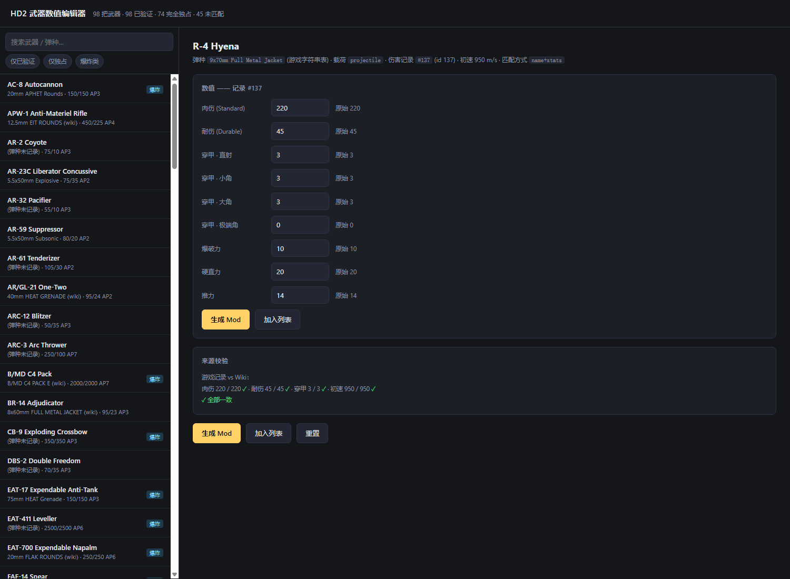

# HD2 Weapon Stat Editor

[中文](README.md)

> **This is cheating, and it is not for public lobbies.**
>
> The mod this tool generates changes real weapon damage values. In theory only
> you see the effect, but that is beside the point: it is cheating, injected
> through the mod system rather than a trainer. **Do not use it in public
> lobbies.** It was built for play inside a small private group, and that is the
> only way it should be used.

A GUI tool that edits **weapon damage values** in Helldivers 2 at runtime, and
packages the change as a mod you install like any other.

Pick a weapon, change its numbers, generate a mod. Nothing on disk is
modified — the mod writes the new values into the running game's memory after
it starts, so the change applies to that session and disappears when you close
the game.



## What it can change

Every weapon has a damage record holding:

| Field | Meaning |
|---|---|
| 肉伤 / damage | damage against unarmoured targets |
| 耐伤 / durable | damage against armoured parts |
| 穿甲 / armor penetration | per impact angle (4 values, usually all the same) |
| 爆破力 / 硬直力 / 推力 | demolition strength, stagger force, push impulse |

Explosive weapons deal damage **twice** — once when the projectile hits, once
when it explodes. Those are two separate records with separate values, so the
panel shows both and lets you edit each independently.

## Requirements

- Helldivers 2 on Windows
- [Bingus Shared Loader](https://www.nexusmods.com/helldivers2/mods/908020)
  v14 or newer, installed and enabled
- HD2 Arsenal (or any mod manager that can import a ZIP) to install the
  generated mod

The loader is what makes third-party Lua run. The generated mod registers
itself into a slot the loader already declares, so it coexists with the other
mods installed there — nothing gets displaced.

## Using it

**Easiest:** run `HD2WeaponEditor-Standalone.exe`. No Python needed.

**From source:**

```
pip install flask pywebview
python gui/desktop.py          # native window
python gui/app.py              # or: browser at http://127.0.0.1:8777
```

Then:

1. Pick a weapon from the list.
2. Change the values. The **original value** is shown next to each field.
3. Click **生成 Mod / Generate** — or **加入列表 / Add to queue** to batch
   several weapons into one mod.
4. Install the resulting ZIP with your mod manager. It is written to a `build\`
   folder next to the exe — if the exe is in `D:\Downloads\`, the ZIP is at
   `D:\Downloads\build\HD2-Weapon-Stat-Editor.zip`. The full path is also shown
   in the interface.
5. Start the game. The log at
   `%LOCALAPPDATA%\CowboyBingus\Helldivers2\Logs\WeaponEditor.log` says what
   happened.

Editing several weapons in one mod costs **one** lookup, not one per weapon:
the first record resolved fixes the damage table's base address and the rest are
addressed by offset.

Startup does **not** stall. See [How it works](#how-it-works) — the table is
reached through a fixed offset in the game module, not by searching for it.

## Warnings you will see

**The tool refuses to edit anything it cannot verify.** Before offering a
weapon it cross-checks the game's table against the wiki — damage, durable
damage, armor penetration and muzzle velocity. If those disagree, one of the
two is stale, the row number may be wrong, and generating is blocked.

**Some weapons share a damage record.** Editing one changes all of them. The
panel names exactly which weapons are affected and which half of the weapon
(impact or explosion) they share. Generating asks you to confirm once, and the
change is not limited to one weapon.

**A weapon can share its impact record and not its explosion record**, or the
reverse. The list badges (`直击共享` / `爆炸共享`) and the detail panel show
each half separately, because they are independent rows with independent
owners.

**Weapons added in the newest game update cannot be edited yet.** The tool joins
the chain weapon name (wiki) → ammo name (wiki) → projectile record (game) →
damage record (game), and every hop needs a key that exists on both sides. The
new weapons are missing the middle hop: the wiki's machine-readable data table
has not been updated for them yet (the page prose has figures, but the table the
tool reads is still empty), so there is no ammo name to match on and the
four-field check cannot run. **This fixes itself once the wiki catches up — no
tool change needed.** Run `python tools/diagnose_new_weapons.py` to see which hop
fails for a given weapon.

## Repository contents

```
gui/            the interface (Flask + HTML, wrapped in a native window)
tools/          data parsing, weapon mapping, mod generation
mod_template/   the Lua that ships inside a generated mod
tests/          39 offline suites + a headless-browser DOM test
data/           derived tables (see below)
docs/           status notes and screenshots
```

### About `data/`

The repository ships **only derived data** — `data/*.json`, produced by parsing
a local game install. It contains no game assets.

The extracted game tables themselves (`data/raw/*.dl_bin`, `data/strings.json`,
…) are deliberately **not** committed: they are unpacked copies of the game's
own files. `tests/test_data_equivalent.py` asserts the derived JSON matches the
game table row for row, so the substitution is checked rather than assumed.

To re-derive everything from a local install, see `tools/parse_dlbin.py` and
`tools/wiki_names.py`.

## Tests

```
python tools/gen_mod.py --weapon "R-4 Hyena" --damage 400 --durable 200 --ap 7 --out build
for t in tests/test_*.py; do python "$t"; done
node tests/test_gui.mjs        # needs the GUI server running
bash tests/test_gui_dom.sh     # headless Chromium against the real DOM
```

Most suites load the **real compiled Lua** into a stubbed engine and assert the
degraded paths too, not just the happy path. Several were written to fail on
the pre-fix code first, so they pin behaviour rather than describe it.

The tool needs the game's own `lua51.dll` to compile Lua into the bytecode the
game loads, so it has to be able to locate your install.

It finds it automatically, in this order:

1. the `HD2_LUA_DLL` environment variable, if you set one
2. a `lua51_dll` path in `hd2editor.json` next to the exe
3. **Steam's own records** — the Steam path from the registry, plus every
   library registered in `libraryfolders.vdf`, so a game installed on any drive
   is found

If yours is a non-Steam install, or discovery fails, create `hd2editor.json`
next to the exe:

```json
{ "lua51_dll": "X:\\your\\path\\Helldivers 2\\bin\\lua51.dll" }
```

When it cannot find the file the interface lists **every path it tried** and
**the Steam libraries it detected**, so the message can be acted on directly.

## How it works

```
weapon  ──uses──▶  projectile  ──points at──▶  damage record
(R-4)              (9x70mm FMJ)                (220 / 45, AP 3)
```

A weapon stores **no damage of its own** — only which projectile it fires. The
damage numbers live on a record that the projectile references, so "change the
weapon's damage" and "change its ammo's damage" are the same write.

The generated mod finds that record in memory and overwrites it.

### Finding the table

The damage table is game state on the heap, and its address is different on
every launch — the module base is randomised by ASLR and the allocation lands
wherever the heap puts it. The first version of this tool therefore had to
**search** for the record: several GB of the process, walking it in budgeted
chunks. That worked, but it cost 35–57 seconds on every launch, and the player
felt it as a startup stall.

The table is now reached through a **fixed offset in the game module**:

```
array = *(game.dll + 0x2ac7cb0)
```

`game.dll` itself moves every launch, but that offset held a pointer to the
damage array at the same value across independent launches, so the whole table
resolves in one read. The search is still there as a fallback.

Failure is designed to be free: the address read through the offset is verified
before use — it must be committed memory, and a row reached through it must pass
the same identity check the search uses. If either fails, the offset is
abandoned for that session and the scan runs instead, which is exactly what the
tool did before. A game patch that moves the table costs you the old behaviour,
not a broken mod.

### Being conservative

- reads are **budgeted per call** and resume across frames, so the game keeps
  its frame time if the fallback scan runs;
- the address space is walked **once**, not once per weapon;
- it **stops the moment it succeeds**, and writes nothing if any guard fails.

Guards: the game module's SHA-256 must match the build it was generated for;
the record's identity must match (its type id plus a four-field fingerprint
and its neighbours); and the target must be committed, writable, private
memory.

## Credits

Damage table layout and archive format were derived with
[`xypwn/filediver`](https://github.com/xypwn/filediver). Weapon and ammunition
names come from the community wiki. The runtime-memory approach follows the
technique used by existing published mods.

## Legal

Not affiliated with Arrowhead Game Studios or Sony. Helldivers 2 is their
property. No game assets are redistributed here.

Modifying gameplay data can violate the game's terms of service and carries
whatever risk that implies. Use at your own risk.
